# 📊 Day 2 — Finding Data and Market Inefficiencies

> **Mission for Today:**  
> Learn how to spot unoptimized workflows, data blind spots, and information asymmetries that create *AI arbitrage opportunities.*  
> By the end of today, you’ll know how to use data tools, public datasets, and structured thinking to identify profitable inefficiencies in any market.

---

## 📚 Learning Objectives

By the end of this module, you will:

- Understand **what makes an inefficiency valuable** in an AI-driven economy.  
- Learn **where to find open, real, and ethical datasets** for exploration.  
- Apply a simple **3×3 Market Inefficiency Matrix** to rank arbitrage potential.  
- Build your own **Data Opportunity Notebook** to track ideas for later automation.

---

## 💡 What is a Market Inefficiency in AI?

In AI terms, an inefficiency is a **repeatable task or dataset** that’s:

- **Expensive to process manually**
- **Frequent enough to justify automation**
- **Unclaimed or under-utilized by existing solutions**
- **Solvable with today’s public AI tools**

These inefficiencies are everywhere — from slow government data releases to outdated workflows in corporate marketing or compliance.

---

## 🧩 The 3 Sources of Inefficiency

| Source Type | Description | Example |
|--------------|--------------|----------|
| **Data Gaps** | Public data exists but is hard to extract, analyze, or visualize. | Government procurement or GAO energy reports requiring manual summaries. |
| **Process Gaps** | Repetitive, rule-based workflows without automation. | Monthly sales reports compiled manually from multiple CSVs. |
| **Adoption Gaps** | Teams have access to AI tools but lack strategy or prompt design. | Marketing teams paying agencies for tasks ChatGPT can handle. |

---

## 🌍 Step 1 — Explore Open Data Ecosystems

These sources are gold mines for arbitrage research:

| Platform | Focus | Example Use |
|-----------|--------|-------------|
| [data.gov](https://data.gov) | U.S. federal datasets | Environmental, health, education data |
| [gao.gov](https://www.gao.gov/) | Government accountability and infrastructure data | Energy inefficiencies, oil rig decommission delays |
| [worldbank.org/data](https://worldbank.org/data) | Global development data | Emerging market trends |
| [Kaggle Datasets](https://kaggle.com/datasets) | Crowdsourced machine learning datasets | Retail, finance, sentiment analysis |
| [AWS Open Data](https://registry.opendata.aws/) | High-volume storage datasets | Satellite imagery, weather, genomics |
| [Google Trends](https://trends.google.com) | Consumer demand signals | Search interest gaps for new AI tools |

---

## 🧠 Step 2 — The 3×3 Inefficiency Matrix

Evaluate opportunities by scoring them from **1–3** across three criteria:

| Criteria | Definition | Score Range |
|-----------|-------------|-------------|
| **Volume** | How often the problem occurs | 1 = Rare, 3 = Constant |
| **Complexity** | How much AI could simplify it | 1 = Simple, 3 = Complex |
| **Monetization** | How easily value can be captured | 1 = Hard to monetize, 3 = Easy |

Then calculate:

```

Opportunity Score = (Volume + Complexity + Monetization) / 9 × 100%

````

Example:

| Idea | Volume | Complexity | Monetization | Score |
|------|---------|-------------|--------------|-------|
| Summarizing GAO Energy Reports | 3 | 3 | 2 | **89%** |
| Automating Job Descriptions | 3 | 2 | 3 | **89%** |
| Daily LinkedIn Post Generator | 2 | 1 | 3 | **67%** |

Anything above **75%** deserves deeper exploration.

---

## 🧮 Step 3 — Build a Simple Opportunity Notebook

Create a file in your repo named `Data_Opportunities.md` and use this template:

```markdown
### AI Arbitrage Opportunity Entry

**Date:**  
**Problem / Inefficiency:**  
_Describe the recurring issue or gap._

**Data Source(s):**  
_List URLs, datasets, or APIs._

**Existing Solutions (if any):**  
_Competitors or alternatives._

**Potential AI Fix:**  
_Which tool, model, or pipeline could solve it?_

**Estimated Market Value:**  
_(Time saved × number of potential users)_

**Next Action:**  
_(Collect more data, test prototype, build dashboard, etc.)_
````

---

## 📈 Step 4 — Visualize Inefficiency Scoring

You can quickly visualize your ideas with a Mermaid chart to compare opportunities:

```mermaid
quadrantChart
    title AI Arbitrage Opportunity Map
    x-axis Low Volume --> High Volume
    y-axis Low Complexity --> High Complexity
    quadrant-1 "💰 High Impact"
    quadrant-2 "🎯 Strategic Niche"
    quadrant-3 "💡 Experimental"
    quadrant-4 "📉 Low ROI"
    "GAO Energy Reports": [0.9, 0.8]
    "LinkedIn Automation": [0.8, 0.6]
    "Healthcare Compliance Data": [0.7, 0.9]
```



---

## ⚙️ Step 5 — Build a Lightweight Data Exploration Workflow

You can use **Mito Labs** (or plain Python + Pandas) to explore datasets locally.

Example (in a Jupyter notebook):

```python
import pandas as pd

# Load dataset
df = pd.read_csv("energy_infrastructure.csv")

# Identify missing data or anomalies
summary = df.describe(include='all')
missing = df.isnull().sum().sort_values(ascending=False)

# Quick insight
print("Top 5 missing columns:\n", missing.head())
```

This is how you start quantifying inefficiencies — you’re literally **measuring opportunity.**

---

## 💬 Real Example: GAO Oil Rig Decommissioning Dataset

* Over **500 offshore oil platforms** in the Gulf of Mexico are **past their removal deadlines**, per GAO (2024).
* Each rig’s operational data, cost projection, and environmental metrics are **public but fragmented.**
* A small AI pipeline could automate:

  * **Report parsing** → `data.gov` or GAO PDFs
  * **Clustering** rigs by decommission delay
  * **Creating dashboards** for investors, energy firms, or policymakers

This is a textbook *AI Arbitrage Opportunity* — where transparency, environmental ethics, and business incentives align.

---

## 🎯 Reflection Questions

1. Which industries or workflows do I have insider access to?
2. What public data sources are under-analyzed in my field?
3. Could I combine two datasets (e.g., GAO + NOAA) to create unique insights?
4. What problems frustrate professionals that AI could simplify?

---

## 🧩 Bonus Exercise (Optional)

Pick one dataset from [data.gov](https://data.gov) or [gao.gov](https://gao.gov/products/gao-24-106229)
and build a quick summary table:

| Field              | Issue                       | AI Tool             | Potential Value        |
| ------------------ | --------------------------- | ------------------- | ---------------------- |
| Offshore Rigs      | Delayed decommissioning     | ChatGPT + Plotly    | Transparency dashboard |
| Disaster Grants    | Slow disbursement reporting | Mito + Python       | Faster accountability  |
| Health Inspections | Unstructured PDFs           | Claude + LlamaParse | Structured CSV export  |

---

## 🏁 Summary

By now, you’ve learned:

* What makes an inefficiency valuable
* Where to find real-world data opportunities
* How to score and visualize them

Tomorrow, you’ll automate the first one.
We’ll use **Mito Labs and Python** to turn one inefficiency into a working AI workflow.

---

## 🧭 Next Module

**➡️ [Day 3 — Automating AI Workflows](Day3_Automating_AI_Workflows.md)**

---

**© 2025 Erwin Maurice McDonald**
Released under the **DACR License** — *Defensive AI Commercial Rights*.

```
