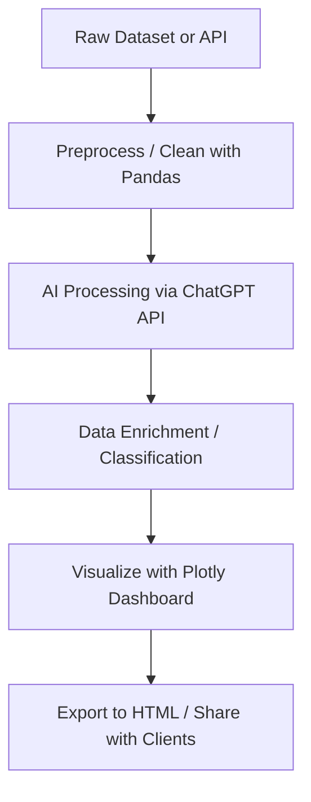

# ⚙️ Day 3 — Automating AI Workflows

> **Mission for Today:**  
> Learn how to transform repetitive, manual processes into **AI-powered workflows** that create measurable time savings, consistency, and profit potential.

---

## 📚 Learning Objectives

By the end of this module, you will:

- Understand how to **map and automate** a manual workflow using AI tools.  
- Learn the **core building blocks** of AI pipelines: data ingestion, processing, and visualization.  
- Create a simple **end-to-end Python workflow** using ChatGPT (API), Pandas, and Plotly.  
- Identify which workflows are **worth scaling** into products or services.

---

## 💡 What Is an AI Workflow?

An **AI workflow** is a repeatable automation pipeline that:
1. Takes structured or unstructured input (data, text, audio, etc.).
2. Processes it with an AI model or combination of tools.
3. Outputs value in a clear, usable format (report, dashboard, alert, email, etc.).

> Example:  
> “Summarize daily customer feedback → classify by sentiment → visualize results in a dashboard.”

---

## 🧩 Anatomy of an AI Workflow

```mermaid
flowchart LR
    A[Input Data] --> B[Preprocess / Clean]
    B --> C[AI Model or API]
    C --> D[Transform / Summarize / Score]
    D --> E[Visualize or Automate Output]
    E --> F[Save / Share / Trigger Next Step]
````

Every arbitrage system you build in this course will follow this basic pattern.

---

## 🧭 Step 1 — Choose a Workflow to Automate

Start with something repetitive, measurable, and small. Examples:

* Summarizing GAO infrastructure reports into structured tables.
* Extracting topics from daily marketing news.
* Turning social comments into categorized feedback.
* Compiling performance metrics from CSVs into dashboards.

Use this quick test:

> If it happens **3+ times a week** and you can describe it in a sentence — automate it.

---

## ⚙️ Step 2 — Define Inputs and Outputs

| Step        | Example                                              |
| ----------- | ---------------------------------------------------- |
| **Input**   | Raw data (CSV, text file, or API endpoint)           |
| **Process** | Clean → analyze → generate summary with ChatGPT      |
| **Output**  | HTML report, Excel file, or interactive Plotly chart |

**Tip:** Keep outputs visual — dashboards convert faster than data dumps.

---

## 💻 Step 3 — Build Your First AI Workflow (Python Example)

Below is a **ChatGPT → CSV → Plotly** pipeline that you can copy into Jupyter, Mito, or VS Code.

```python
# --- Day 3: Simple AI Workflow Example ---
import os
import pandas as pd
import openai
import plotly.express as px

# 1. Set API key (use environment variables for safety)
openai.api_key = os.getenv("OPENAI_API_KEY")

# 2. Load or create sample data
data = {
    "Report_ID": [1, 2, 3],
    "Title": [
        "Offshore Decommissioning Costs Rising",
        "Renewable Transition Delays in Texas",
        "Marine Infrastructure Overhaul Plan"
    ],
    "Summary": ["", "", ""]
}
df = pd.DataFrame(data)

# 3. Use ChatGPT to summarize titles (AI processing)
for i, row in df.iterrows():
    prompt = f"Summarize this report title in 2 sentences: {row['Title']}"
    response = openai.ChatCompletion.create(
        model="gpt-3.5-turbo",
        messages=[{"role": "user", "content": prompt}],
        max_tokens=60
    )
    df.at[i, "Summary"] = response.choices[0].message.content.strip()

# 4. Visualize with Plotly (data simulation)
df["Category"] = ["Energy", "Infrastructure", "Policy"]
fig = px.bar(df, x="Category", y="Report_ID",
             color="Category",
             title="Automated AI Summary Dashboard",
             text="Summary")
fig.show()
```

✅ **This demonstrates:**

* AI language processing
* Dynamic data enrichment
* Automated visualization

---

## 🧩 Step 4 — Visualize the Workflow in Mermaid



This flow shows the **complete arbitrage cycle** — turning public or internal data into a sellable insight.

---

## ⚡ Step 5 — Automate with Mito Labs

If you’re non-technical or prefer a spreadsheet feel:

1. Load your CSV into **Mito (Jupyter extension)**.
2. Perform data cleaning manually once — Mito records the steps as Python code.
3. Copy the generated code into your `workflow.py`.
4. Run it anytime for fresh data.

That’s instant, low-code automation.

---

## 🧮 Step 6 — Measure ROI of Automation

Use this formula to track workflow value:

```
ROI = (Manual Hours Saved × Hourly Rate × Frequency) – Automation Cost
```

| Metric             | Example          |
| ------------------ | ---------------- |
| Manual Hours Saved | 5 hrs/week       |
| Hourly Rate        | $50/hr           |
| Automation Cost    | $10/month        |
| **ROI / Month**    | **≈ $990 saved** |

If your workflow saves 20+ hours/month, you’ve built a valid arbitrage asset.

---

## 💬 Reflection Questions

1. What workflows in my daily tasks are rule-based and predictable?
2. Which datasets do I repeatedly format or analyze?
3. Could this workflow be resold as a service or SaaS template?
4. How can I visualize results for faster decision-making?

---

## 🧩 Bonus Exercise (Optional)

Take your top-scoring idea from **Day 2** and:

1. Write a 2-line process description.
2. Sketch a Mermaid workflow.
3. Run a simple automation using ChatGPT or Claude.
4. Save it as `My_First_AI_Workflow.md` in your repo.

---

## 🏁 Summary

You’ve now built your first **AI arbitrage automation pipeline**.
Tomorrow, we’ll go deeper — creating **autonomous agents** that run, test, and optimize workflows without human oversight.

---

## 🧭 Next Module

**➡️ [Day 4 — Building and Testing AI Agents](Day4_Building_and_Testing_AI_Agents.md)**

---

**© 2025 Erwin Maurice McDonald**
Released under the **DACR License** — *Defensive AI Commercial Rights*.

