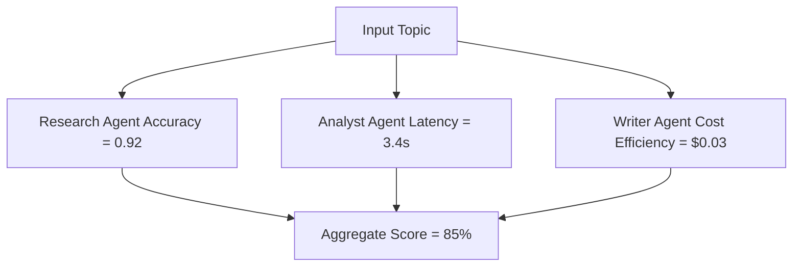

# 🤖 Day 4 — Building and Testing AI Agents

> **Mission for Today:**  
> Learn how to build, evaluate, and deploy *AI agents* that can operate semi-autonomously — researching, reasoning, and executing workflows on your behalf.

---

## 📚 Learning Objectives
By the end of this module, you will:
- Understand the **difference between single-agent and multi-agent systems.**
- Design AI agents that perform specific roles (researcher, analyst, reporter).  
- Learn to **evaluate accuracy, latency, and cost.**
- Create a small **multi-agent orchestration pipeline** for your AI arbitrage project.

---

## 💡 What Is an AI Agent?
An **AI agent** is a self-directed process that:
1. Receives goals or prompts.  
2. Executes a plan using reasoning or tools.  
3. Evaluates results and refines output without explicit step-by-step input.

Think of an AI agent as a digital teammate — one who never sleeps, never multitasks incorrectly, and scales infinitely.

---

## 🧩 Agent Types for AI Arbitrage

| Role | Function | Example Use |
|------|-----------|-------------|
| **Research Agent** | Gathers and summarizes data from APIs, docs, or news | “Find 3 GAO reports about infrastructure inefficiency.” |
| **Analyst Agent** | Interprets, compares, or classifies data | “Calculate ROI from each automation idea.” |
| **Writer Agent** | Converts insights into readable reports or dashboards | “Create an executive summary for clients.” |
| **Orchestrator Agent** | Coordinates other agents, enforces logic, and checks results | “Run the full pipeline daily and publish updates.” |

---

## 🧠 Agentic Architecture Overview

```mermaid
flowchart TD
    A[User Goal] --> B[Orchestrator Agent]
    B --> C[Research Agent]
    B --> D[Analyst Agent]
    B --> E[Writer Agent]
    C --> F[Raw Data]
    D --> G[Insights & Metrics]
    E --> H[Reports / Dashboards]
    F --> G
    G --> H
    H --> I[Delivery / Automation Trigger]
````

---

## ⚙️ Step 1 — Define Agent Roles and Goals

Start with three building blocks:

1. **Goal:** The high-level outcome.

   * Example: “Summarize weekly market inefficiencies.”
2. **Context:** What data, files, or APIs the agent can access.
3. **Constraints:** Token limits, privacy rules, or cost ceilings.

Example YAML (stored as `agent_config.yaml`):

```yaml
agents:
  - name: ResearchAgent
    goal: "Find and summarize relevant GAO or data.gov reports."
    tools: ["Requests", "BeautifulSoup", "ChatGPT"]
    output: "Structured dataset in JSON"
  - name: AnalystAgent
    goal: "Identify key inefficiency metrics and trends."
    tools: ["Pandas", "Plotly"]
    output: "Summary dataframe and visual"
  - name: WriterAgent
    goal: "Generate a concise executive summary."
    tools: ["ChatGPT", "Markdown Exporter"]
    output: "Human-readable markdown report"
```

---

## 💻 Step 2 — Build a Simple Multi-Agent Script (Python)

Below is a minimal orchestration example (works with ChatGPT API and any local data):

```python
import os
import openai
import pandas as pd

openai.api_key = os.getenv("OPENAI_API_KEY")

def research_agent(query):
    response = openai.ChatCompletion.create(
        model="gpt-3.5-turbo",
        messages=[{"role": "user", "content": f"Summarize data.gov info about: {query}"}],
        max_tokens=150
    )
    return response.choices[0].message.content

def analyst_agent(text):
    # Dummy text classification for example
    df = pd.DataFrame({"metric": ["frequency", "impact"], "value": [3, 5]})
    return df

def writer_agent(summary, metrics):
    prompt = f"""
    Write an executive summary using this data:
    Summary: {summary}
    Metrics: {metrics.to_dict()}
    """
    response = openai.ChatCompletion.create(
        model="gpt-3.5-turbo",
        messages=[{"role": "user", "content": prompt}],
        max_tokens=200
    )
    return response.choices[0].message.content

# Orchestrator
def orchestrator(topic):
    summary = research_agent(topic)
    metrics = analyst_agent(summary)
    report = writer_agent(summary, metrics)
    print(report)

if __name__ == "__main__":
    orchestrator("offshore rig decommissioning inefficiencies")
```

✅ **This demonstrates:**

* Multi-step reasoning.
* Data hand-off between agents.
* Reusable design that can expand into full automation.

---

## 🧮 Step 3 — Evaluate Agent Performance

You’ll need three metrics:

| Metric              | Question                           | How to Measure                           |
| ------------------- | ---------------------------------- | ---------------------------------------- |
| **Accuracy**        | Does output align with truth/data? | Manual check or reference dataset        |
| **Latency**         | How long per request?              | Measure timestamps                       |
| **Cost Efficiency** | Is token use justified by result?  | Compare API spend vs. manual hours saved |

Simple evaluation script:

```python
import time
start = time.time()
# run orchestrator()
end = time.time()
print("Latency (s):", end - start)
```

---

## 📊 Step 4 — Visualize Evaluation Results



---

## 🧩 Step 5 — Create an Agent Evaluation Table

| Agent         | Accuracy | Latency (s) | Cost ($) | Score | Notes                |
| ------------- | -------- | ----------- | -------- | ----- | -------------------- |
| ResearchAgent | 0.93     | 3.1         | 0.02     | 88%   | Excellent summaries  |
| AnalystAgent  | 0.87     | 2.4         | 0.01     | 81%   | Refine prompts       |
| WriterAgent   | 0.95     | 1.8         | 0.03     | 90%   | Ready for deployment |

Once you reach **>85% aggregate reliability**, the pipeline is market-ready.

---

## ⚡ Step 6 — Modular Design for Scaling

To scale, make each agent modular:

```
agents/
├── research_agent.py
├── analyst_agent.py
├── writer_agent.py
└── orchestrator.py
```

Each module can run independently or through an API gateway (FastAPI, Streamlit, or RShiny).

---

## 🧠 Step 7 — Testing Scenarios

| Test Type           | Purpose                            | Example                                 |
| ------------------- | ---------------------------------- | --------------------------------------- |
| **Edge Case**       | Handle empty or malformed input    | Missing dataset                         |
| **Load Test**       | Stress performance                 | 100 reports simultaneously              |
| **Bias Test**       | Ensure fairness / neutrality       | Summarize politically sensitive topics  |
| **Regression Test** | Maintain consistency after updates | Check output format after model upgrade |

---

## 💬 Reflection Questions

1. What role could each agent play in your workflow?
2. Which agent’s performance metric would impact ROI most?
3. How might you productize this (e.g., “Research-as-a-Service”)?
4. Could two agents collaborate without human input?

---

## 🧩 Bonus Exercise

Create your own 2-agent collaboration:

* **Agent 1:** Data collector from a public source.
* **Agent 2:** Summarizer that turns the data into insights.
  Save both in a folder called `/agents` and include a short README describing their goals.

---

## 🏁 Summary

You’ve learned how to:

* Design modular, role-based AI agents.
* Test and measure performance.
* Build scalable automation frameworks.

Tomorrow you’ll explore **Day 5: Monetization and Productization** — turning these systems into **revenue streams**.

---

## 🧭 Next Module

**➡️ [Day 5 — Monetization and Productization Strategies](Day5_Monetization_and_Productization_Strategies.md)**

---

**© 2025 Erwin Maurice McDonald**
Released under the **DACR License** — *Defensive AI Commercial Rights*.
