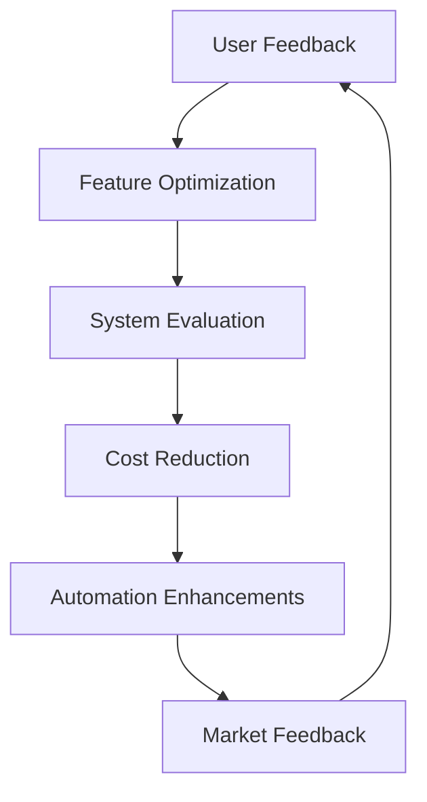

# 🌍 Day 7 — Scaling & Sustainability in AI Arbitrage

> **Mission for Today:**  
> Learn how to scale your AI arbitrage business responsibly — balancing automation, ethics, and global opportunity with sustainable growth and operational excellence.

---

## 📚 Learning Objectives

By the end of this module, you will:
- Understand how to **scale AI workflows** from solo projects to teams and enterprises.  
- Learn sustainable infrastructure and cost-control strategies.  
- Design a **governance framework** that ensures long-term trust and compliance.  
- Build a roadmap for **funding, partnerships, and continuous learning.**

---

## 💡 The Principle: “Scale isn’t growth — sustainability is.”

In the AI ecosystem, **speed alone is not a strategy**.  
You scale sustainably when:
1. Revenue scales faster than cost.  
2. Systems stay transparent and auditable.  
3. Your brand grows trust with every deployment.  
4. You invest in community, ethics, and feedback loops.

> “The future belongs to companies that can grow without burning out — or burning trust.”

---

## 🧩 Step 1 — The 3 Dimensions of Scaling AI

| Dimension | Focus | Key Question |
|------------|--------|---------------|
| **Technical Scale** | Infrastructure, automation, pipelines | “Can we handle 10× users or data?” |
| **Organizational Scale** | Roles, workflows, and communication | “Can we collaborate without chaos?” |
| **Market Scale** | Demand, pricing, partnerships | “Can we grow without losing identity?” |

These three dimensions must stay balanced — technical capacity means nothing without operational clarity.

---

## ⚙️ Step 2 — Build Scalable Infrastructure

**Low-cost, high-efficiency setup:**

| Layer | Tool / Platform | Purpose |
|--------|----------------|----------|
| **Frontend / UI** | Streamlit, RShiny, Vercel | User-facing dashboards |
| **Backend** | FastAPI, Flask, or Supabase | Agent orchestration & APIs |
| **Data Layer** | PostgreSQL, SQLite, or Tinybird | Store inputs and outputs securely |
| **Automation Layer** | LangChain / CrewAI / Airflow | Automate scheduled tasks |
| **Cloud / Container** | Docker + Azure / AWS Lightsail | Portable, scalable deployments |
| **Monitoring** | Grafana / Prometheus / Datadog | Track uptime, latency, cost |
| **Ethics / Governance** | DACR license + audit logs | Compliance and trust assurance |

💡 *Rule of thumb:* Automate after consistency, not before.  
Document what works manually before scaling programmatically.

---

## 🧠 Step 3 — Team Structure for Growth

Even AI-first companies need human clarity.  

| Role | Responsibility | Tool Stack |
|------|----------------|-------------|
| **AI Strategist (You)** | Vision, design, product direction | ChatGPT, Notion, Figma |
| **Data Engineer** | ETL, model optimization | SQL, Pandas, Mito |
| **Product Manager** | Market alignment, customer feedback | Trello, Slack, Loom |
| **UI/UX Designer** | Frontend experience | Figma, Canva, Tailwind |
| **Automation Engineer** | Infrastructure + CI/CD | GitHub Actions, Docker |
| **Ethics Officer** | DACR compliance & oversight | Policy checklists, dashboards |

> Build teams like agents: small, modular, mission-aligned.

---

## 📈 Step 4 — Scaling Roadmap

```mermaid
flowchart LR
    A[Proof of Concept] --> B[Minimum Viable Product]
    B --> C[Operational Automation]
    C --> D[Market Validation]
    D --> E[Funding & Partnerships]
    E --> F[Global Expansion]
    F --> G[Sustainability & Governance]
````

### Roadmap Milestones:

1. **Prototype:** 1–3 users, manual validation.
2. **MVP:** Functional dashboard or automation with measurable ROI.
3. **Automation:** Set up scripts or agent orchestration.
4. **Market Validation:** Gather testimonials, improve UX.
5. **Funding:** Raise early-stage capital or revenue reinvestment.
6. **Expansion:** Local → regional → international scaling.
7. **Governance:** DACR, privacy controls, and bias audits.

---

## 💰 Step 5 — Funding and Revenue Models

| Stage              | Goal                  | Funding Source                         | Example                  |
| ------------------ | --------------------- | -------------------------------------- | ------------------------ |
| **Seed**           | Build MVP             | Personal savings / grants              | $5K–$25K                 |
| **Pre-Launch**     | Beta testers / pilots | Accelerators or angel investors        | $10K–$100K               |
| **Growth**         | Expand capacity       | Strategic partnerships or crowdfunding | $50K–$500K               |
| **Sustainability** | Stabilize cash flow   | Subscription revenue                   | $1K–$10K/month recurring |

> “Investors buy systems, not sprints. Build something that earns while you sleep.”

---

## 🌱 Step 6 — Environmental and Ethical Sustainability

AI scaling shouldn’t harm the planet — or people.

| Area                         | Sustainable Practice                                        | Example                                     |
| ---------------------------- | ----------------------------------------------------------- | ------------------------------------------- |
| **Energy Efficiency**        | Optimize compute cycles, use carbon-aware scheduling        | Host models in regions with renewable grids |
| **Infrastructure Recycling** | Use repurposed data centers (e.g., decommissioned oil rigs) | Offshore green datacenters initiative       |
| **Data Ethics**              | Anonymize user inputs                                       | Privacy-first logging                       |
| **AI Lifecycle Management**  | Regularly retrain with diverse datasets                     | Annual fairness audits                      |

**Case Study:**

> Decommissioned oil rigs off the coast of Texas and Galveston are being explored as offshore **AI datacenters**, converting abandoned structures into climate-resilient, water-cooled facilities that reduce onshore energy strain.

This innovation aligns with DACR’s principle of **“Defensive AI for Public Good.”**

---

## 🧩 Step 7 — Partnership and Ecosystem Strategy

Collaborate with:

* **Universities** → Research + ethics partnerships
* **Government agencies (e.g., GAO)** → Data transparency and trust
* **Enterprises** → White-label SaaS or dashboards
* **Startups** → Joint development or cross-promotion

### Partnership Model Visualization

```mermaid
graph TD
    A[Core AI Arbitrage Platform]
    A --> B[Enterprise Partners]
    A --> C[University Collaborations]
    A --> D[Public Sector Initiatives]
    A --> E[Ethical Oversight Boards]
```

Each node strengthens your credibility, compliance, and reach.

---

## ⚡ Step 8 — Continuous Improvement Loop



This **flywheel approach** keeps your system adaptive without constant reinvention.

---

## 🧮 Step 9 — Key Sustainability KPIs

| Category               | Metric                    | Target         | Tool                |
| ---------------------- | ------------------------- | -------------- | ------------------- |
| **Energy Efficiency**  | Compute per transaction   | < 0.05 kWh     | Grafana             |
| **Model Accuracy**     | Precision / recall        | > 90%          | Evaluation pipeline |
| **User Retention**     | Renewal rate              | > 80%          | CRM / Stripe        |
| **Revenue Stability**  | Monthly recurring revenue | 10% MoM growth | Notion / QuickBooks |
| **Ethical Compliance** | DACR adherence            | 100%           | Internal audits     |

---

## 💬 Reflection Questions

1. Which scaling dimension (technical, organizational, or market) are you strongest in?
2. Could you apply your AI arbitrage model to sustainability projects?
3. How can you measure your environmental impact as you grow?
4. What would “sustainable success” look like for your brand?

---

## 🧩 Bonus Exercise

Create a folder `/scaling` and include:

* `scaling_strategy.md` — your next 12-month roadmap
* `team_roles_matrix.md` — list of collaborators and responsibilities
* `partnerships_plan.md` — possible orgs or brands to align with
* `sustainability_model.md` — describe how your project contributes positively to the environment

Each of these files completes your **AI Arbitrage System of Record** — a repository that shows you’re not just building AI, but a *movement*.

---

## 🏁 Final Summary

You’ve completed the **AI Arbitrage 7-Day Course** — mastering:

* AI strategy, arbitrage logic, and agent orchestration
* Monetization, branding, and global positioning
* Ethical growth, scalability, and sustainability

> You are now ready to design, lead, and scale AI systems that generate impact — not just income.

**Congratulations. 🎓**

---

## 🧭 Optional Next Steps

* Build your portfolio repo: `ai-arbitrage-pro`
* Publish your GitHub Pages site using this course as a public learning series
* Add certifications or DACR license badges
* Launch your first client-ready workflow or SaaS MVP

---

**© 2025 Erwin Maurice McDonald**
Released under the **DACR License** — *Defensive AI Commercial Rights*.
